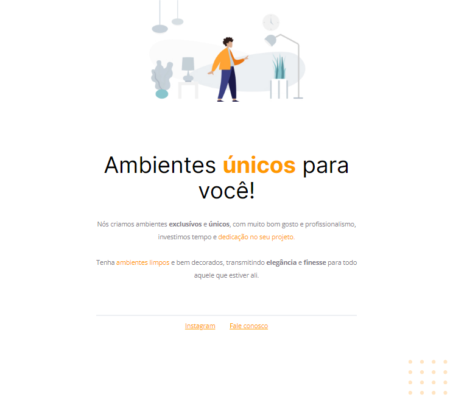

### Environments_Planning
##  Stage01_Rocketseat_Explorer: 

 

  The challenge of this project is to fix bugs, web page that came disconfigured, use HTML and CSS knowledge from studying the Stage 02 module, use figma to follow the project prototype and fix the broken code. 

  Watch Webpage Online: [Click Here](https://ludiemert.github.io/Amb_Planejados/)
  
### What was developed:

- Structuring the project;
- Position the elements on the screen;
- Import external CSS file into the project;
- Apply custom fonts (typography) to the CSS file and start the external CSS file;
- Working with colors and fonts;
- Alignment and positioning of text and elements;
- Apply spacing;
- Sorting borders and elements;
- Using CSS variables to manipulate the color palette of the project;
- Hover effect in the footer HTML link;
- CSS reset removing possible inconsistencies between different browsers;
- Project file system structure separated by folder;
- 

## Layout

- Introduction to HTML and CSS;

- [EXPLORER - Rocketseat](https://www.rocketseat.com.br/explorer)
- [Design Figma - Moveis Customizados](https://www.figma.com/file/S8vpYTmkKbcd9e64RFRqX6/Explorer---Projeto-01-(Copy)?node-id=0%3A1)

### Installation

No installation is required.

### Programs needed to Getting started

- [Visual Studio Code - Vscode](https://code.visualstudio.com/)

## 📦 Development

It is an HTML page styled in CSS, applicable in any WEB system.

## Document Used:

[How the Web Works - Learning web development | MDN](https://developer.mozilla.org/pt-BR/docs/Learn/Getting_started_with_the_web/How_the_Web_works)

## ✒️ Authors

 * **Rocketseat**

- ## My LinkedIn - 

-------

## 🎁 Acknowledgements and dedications

* Thank you Rocketseat team

